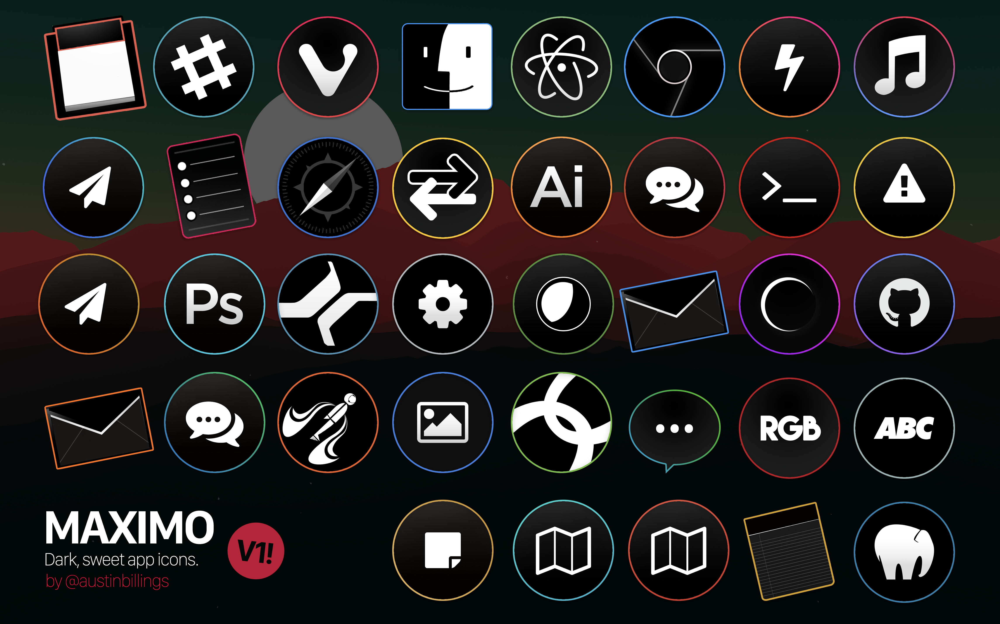

# Maximo Icons
A darkly sweet icon set for your favorite apps. Especially Mac-friendly.

## Quick Preview

**A sampling of the icons.**

**A subset, shown in their natural habitat: the macOS dock.**

## Icons Included

Currently includes the following icons & variants. Edge colors are given in parentheses, with gradient edges expressed with slashes, e.g. 'green/blue':

#### Generic / Non-app-specific
- Envelope-style **Mail** app icons (blue and orange)
- Paper-airplane-style **Mail** app icons (blue and orange)
- Map-style General app Icons (can be used for anything flow/goal-oriented, perhaps Maps or Todo apps) (teal blue and blood orange)
- Gear-style **Settings** app icon (I use it for System Preferences) (grey)
- Reverse-Arrows app icon (I use it for an FTP client) (yellow)
- Circular-style messaging and **Chat**  app icons (in blue/green and red/orange)
- Baloon-style messaging and **Chat**  app icon (green/blue)
- Sticky **Notes** app icon (mild yellow)
- "ABC" app icon (I use it for Font Book) (grey)
- "RGB" app icon (I use it for the Digital Color Meter utility) (red)

#### macOS Native Apps
(Of course, feel free to adapt them to other uses.)

- **Finder** (cool blue)
- **iTunes** (magenta/indigo)
- **Safari** (safari blue)
- **Calendar** (dynamic docktile for actual date overlay) (salmon)
- **Reminders** (or any checklist/todo app) (magenta)
- **Terminal** (or any command line) (red)
- **Console** (or any logging app) (gold)
- **Notes** (or any notes app) (mild yellow)
- **Preview** (or any photos app) (blue)

#### Third-party apps
- **Slack** (teal)
- **Vivaldi** (red/red)
- **Atom** (atom green)
- **Chrome** (google blue)
- **Hyper** (magenta/orange)
- **Presonus** Studio One (studio one blue)
- **Eclipse** IDE (purple/violet)
- **Github** (purple/indigo)
- **MAMP** (mamp blue)
- **Cisco AnyConnect** (grass green)
- **Cisco WebEx** (olive green)
- **Adobe Photoshop** (blue)
- **Adobe Illustrator** (orange)
- **Postman** (orange)

Want to request a new icon to be added? I'd love to. Add your request [as an issue on the "issues" tab](https://github.com/austinbillings/maximo-icons/issues).